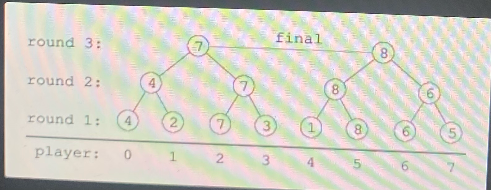

N 명의 선수 (즉, 0 N-1) 가 참여하는 토너먼트가 있다고 합시다. 
K번째 선수의 능력치는 skills[K] 이며, 서로 다른 두 선수의 능력치는 같을 수 없다고 합시다. 

토너먼트 라운드는 최소 2명의 선수가 남을 때까지 반복된다고 합시다. 
하나의 라운드에는 최소 한 건 이상의 경기가 발생하고, 한 건의 경기에서는 두 선수가 경합한다고 합시다. 

경기에서 패 배한 선수는 떨어지고 승리한 선수는 다음 라운드로 진출한다고 합시다. 
라운드에서 선수 0이 선수 1과 경합하고, 선수 2는 선수 3과 경합하는 식으로 마지막 선수까지 모두 경합한다고 합시다. 
2라운드에서는 선수 0, 선수 1간의 경합 승자와 선수 2, 선수 3간의 경합 승자가 경합하는 식으로 역시 마지막 선수까지 모두 경합한다고 하면, 
결국 능력치가 가장 높은 선수가 토너먼트의 패권자가 됩니다. 

가령, skills = [4, 2, 7, 3, 1, 8, 6, 5]라면, 토너먼트의 진행은 다음과 같이 이루어지게 됩니다 (원 안의 숫자는 skills를 표시). 

각 선수가 마지막으로 경합하는 라운드가 어느 라운드인지를 확 인하는 것이 이번 태스크의 목적입니다. 

아래와 같은 함수에서,

`def solution (skills)`

이는 skills를 표시하는 정수 N개 로 구성된 배열이라고 했을 때, 정수 N개의 results 반환되고, 
여기서 results[K]는 K 번째 선수가 마지막으로 경합하는 라운드가 됩니다. 

선언문은 다음과 같이 주어진다고 가정합시다. 

예제:

1. skills = [4, 2, 7, 3, 1, 8, 6, 5]일 시, 함수는 [2, 1, 3, 1, 1, 3, 2, 1]를 리턴하여야 합니다 (상기 예시).
2. skills = [4, 2, 1, 3] 일 시, 함수는 [2, 1, 1, 2]를 리턴하여야 합니다.
3. skills = [3, 4, 2, 1] 일 시, 함수는 [1, 2, 2, 1]를 리턴하여야 합니다.

다음 가정에 대한 효율적인 알고리즘을 작성하십시오: 

• N은 2의 배수인 정수로, [2..262,144] 사이의 정수: 
• 배열 skills의 각 요소는 [1..N] 범위 내의 정수입니다; 
• skills배열 안의 값들은 중복되지 않습니다.